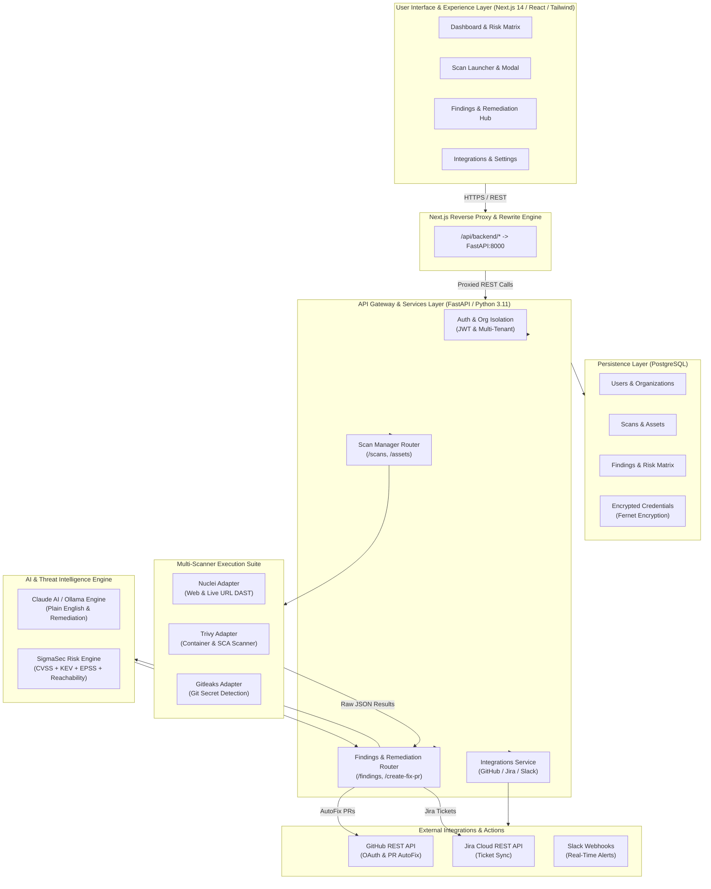

# SigmaSec Security Platform — End-to-End Architecture & Technical Blueprint

**AI-Augmented. Intelligence-Driven. Action-Focused.**

---

## 1. High-Level System Architecture (Single View)

---

## 2. 5-Phase End-to-End Processing Pipeline

```mermaid
sequenceDiagram
    autonumber
    actor SecurityTeam as Security / DevSecOps Team
    participant UI as Platform Frontend
    participant API as FastAPI Backend
    participant Scanner as Multi-Scanner Suite (Nuclei/Trivy/Gitleaks)
    participant Intel as Intelligence & Risk Engine
    participant AI as AI Enrichment Engine
    participant Ext as GitHub / Jira / Slack

    %% Phase 1
    rect rgb(15, 23, 42)
    note right of SecurityTeam: Phase 1: DISCOVER
    SecurityTeam->>UI: Select Target (URL, Container, or Git Repo)
    UI->>API: POST /scans (Target, Scanners, Authorization Check)
    API->>Scanner: Trigger Async Scan Job
    end

    %% Phase 2
    rect rgb(30, 41, 59)
    note right of SecurityTeam: Phase 2: ENRICH
    Scanner-->>API: Raw Findings (CVEs, Secrets, Vulnerabilities)
    API->>Intel: Query CVSS Base + CISA KEV + EPSS Scores
    Intel-->>API: Threat Intel Enrichment Data
    end

    %% Phase 3
    rect rgb(15, 23, 42)
    note right of SecurityTeam: Phase 3: PRIORITIZE
    API->>Intel: Compute SigmaSec Risk Score (0-100)
    Intel-->>API: Asset Weight + Reachability + Exploitability Score
    end

    %% Phase 4
    rect rgb(30, 41, 59)
    note right of SecurityTeam: Phase 4: UNDERSTAND
    API->>AI: Generate Plain-English Summary & Remediation Steps
    AI-->>API: AI Enriched Guidance Payload
    API->>UI: Render Prioritized Finding Matrix & Risk Score (82/100)
    end

    %% Phase 5
    rect rgb(15, 23, 42)
    note right of SecurityTeam: Phase 5: TAKE ACTION
    SecurityTeam->>UI: Click "Create Fix PR" or "Create Jira Ticket"
    UI->>API: POST /findings/{id}/create-fix-pr
    API->>Ext: Push Git Branch & Open Pull Request / Sync Jira Ticket
    Ext-->>UI: Live PR Link & Badge ("PR #142 Open")
    end
```

---

## 3. Core Component Specifications

| Layer | Components & Technologies | Responsibilities |
| :--- | :--- | :--- |
| **Frontend UI** | Next.js 14, React Query, Tailwind CSS, Lucide Icons | Dark glassmorphism dashboard, real-time risk scores, dynamic scan launcher with target validation, responsive multi-tab settings. |
| **API Gateway** | FastAPI, Python 3.11, SlowAPI Rate Limiter | REST API routing, multi-tenant org isolation, JWT auth verification, cross-platform temp directory management. |
| **Multi-Scanner Suite** | **Nuclei** (DAST), **Trivy** (SCA & Container), **Gitleaks** (Secrets) | Multi-target vulnerability scanning, target URL/quote sanitization, structured JSON stdout parsing. |
| **Intelligence Engine** | CVSS 3.1, CISA KEV Database, EPSS Exploit Probability, Reachability Engine | Combines static severity with real-world threat intelligence and reachability to filter out noise and prioritize actionable risks. |
| **AI Enrichment** | Claude AI / Ollama Engine (`AIClient`) | Translates technical vulnerability output into plain-English executive summaries, generates code patches, and checks diff limits (<= 50 lines). |
| **Integration Suite** | GitHub REST API (`PyGithub`), Jira Cloud API, Slack Webhooks | OAuth 2.0 connection, automated `fix/*` branch creation, PR opening, Jira ticket synchronization, and Slack alert webhooks. |
| **Data Persistence** | PostgreSQL, SQLAlchemy ORM, Alembic Migrations, Fernet Encryption | Multi-tenant relational schema, JSONB scan metadata storage, Fernet symmetric encryption for stored API keys and GitHub tokens. |

---

## 4. Key Security & Compliance Features

- **Mandatory Target Authorization**: Every scan launch enforces a mandatory confirmation checkbox (*"I own this target or hold written authorisation to test it."*).
- **Cryptographic Credential Security**: Integrations (GitHub App tokens, Jira tokens, Slack webhooks) are encrypted at rest using Fernet symmetric encryption.
- **Tenant Isolation**: All database queries enforce strict Organization ID filtering (`Finding.org_id == org_id`).
- **Safe AI Patching Limit**: Automated code patching enforces a strict <= 50 line diff threshold to prevent unexpected code churn.
